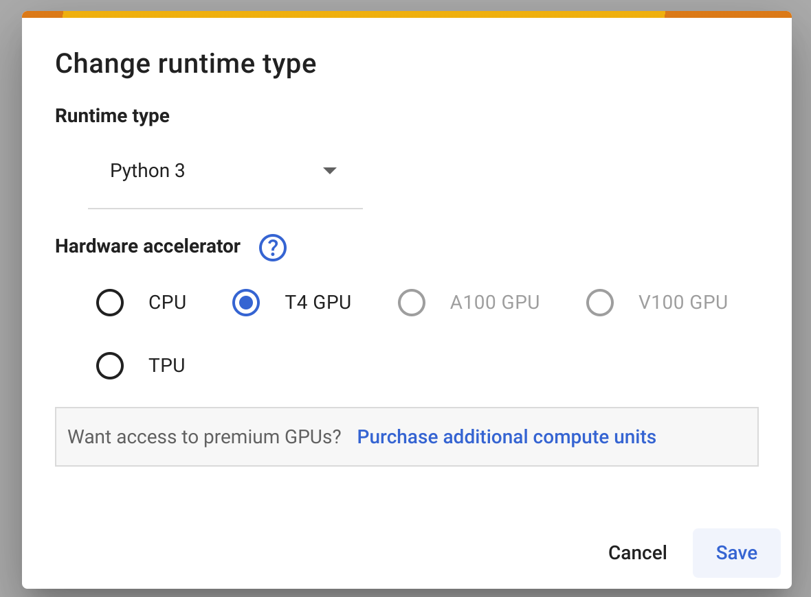

# FastDDM tutorials

## Installation

Follow the [installation guide](https://fastddm.readthedocs.io/en/stable/) on the documentation.
FastDDM was tested on different OSs and python versions.
If you experience troubles installing the library, this might be due to incompatibilities in the system path variables or with the compiler used.

If you still want to test the software, we provide the following two workarounds: Google colab notebook and Docker container.

### Google colab

To use [Google colab](https://colab.research.google.com/), open a new notebook.
If you want to use the GPU provided by the servers, change the runtime type as shown below



You can check what GPU is available by executing inside a cell

```python
!nvidia-smi
```

Then, you want to download and install FastDDM to be used in the notebook.
Run the following lines in a cell:

```python
!git clone https://github.com/somexlab/fastddm.git
%cd fastddm
```

If you want to use the GPU, enable the CUDA option before installing the library

```python
%env ENABLE_CUDA=ON
```

Since the RAM available on colab is limited, we also suggest to enable the single precision option.

```python
%env SINGLE_PRECISION=ON
```

Install the library

```
!python3 -m pip install .
```

Run the tests

```python
python3 -m pip install pytest-regtest
pytest -v
```

Now, you will be able to use FastDDM from the notebook.
